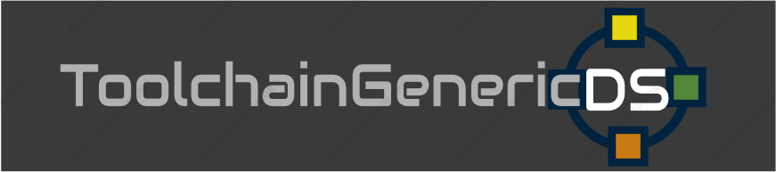

NTR/TWL SDK: TGDS1.64

master: Development branch. Use TGDS1.64Stable: branch for stable features.

This is the ToolchainGenericDS Woopsi argvtest project:

1.	Compile Toolchain:
To compile this project you will need to follow the steps at https://bitbucket.org/Coto88/toolchaingenericds :
Then simply extract the project somewhere.

2.	Compile this project: 
Open msys, through msys commands head to the directory your extracted this project.
Then write:
make clean <enter>
make <enter>

After compiling, run the example in NDS. 

Project Specific description:
A Woopsi UI + TGDS SDK template for UI control handling on the NintendoDS. 
Draw the pop up windows across the screen or scroll other windows to test touchscreen. 
Also plays WAV/AD-PCM (Intel) files from the directory!

Reads arguments (libnds ARGV format) if any, received from former loader. 
Button (Start): Shutdown NDS
Button (Select): GDBGDB Debugging

Usage:
	//Send TGDS/libnds ARGuments 
	char thisArgv[3][MAX_TGDSFILENAME_LENGTH];
	memset(thisArgv, 0, sizeof(thisArgv));
	strcpy(&thisArgv[0][0], "ToolchainGenericDS-multiboot.nds");				//Arg0:	Loader used
	strcpy(&thisArgv[1][0], "0:/directory/filename.txt");						//Arg1: NDS Binary loaded
	addARGV(2, (char*)&thisArgv);
	
	//Receive TGDS/libnds ARGuments:
	See main.c

/release folder has the latest binary precompiled for your convenience.

Latest stable release:
https://bitbucket.org/Coto88/ToolchainGenericDS-argvtest/get/TGDS1.64Stable.zip

Note:
Libnds compatibility is kept. The only thing required, is, if you send a single ARGV in the slot 1 (see above), you need to fill ARGV in slot0 as well. Otherwise ARGV won't be sent.
In libnds, this doesn't happen. But hey, we've got these awesome binaries supported anyway. ;-)

Note: UI Controls experimental.

Coto